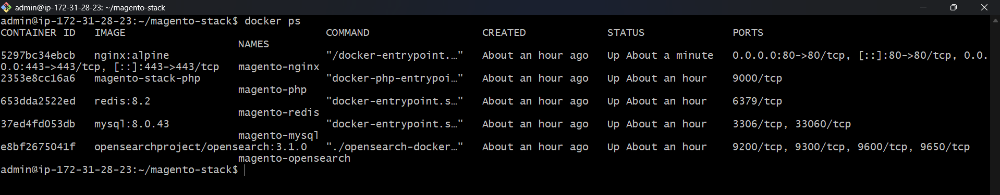
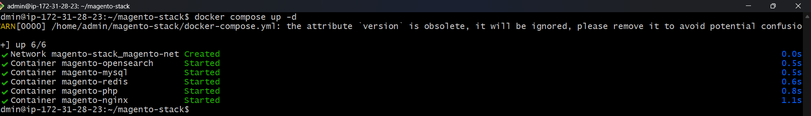
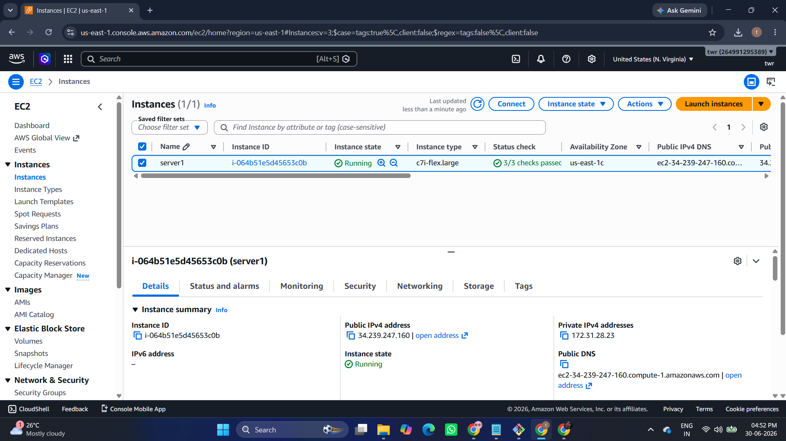
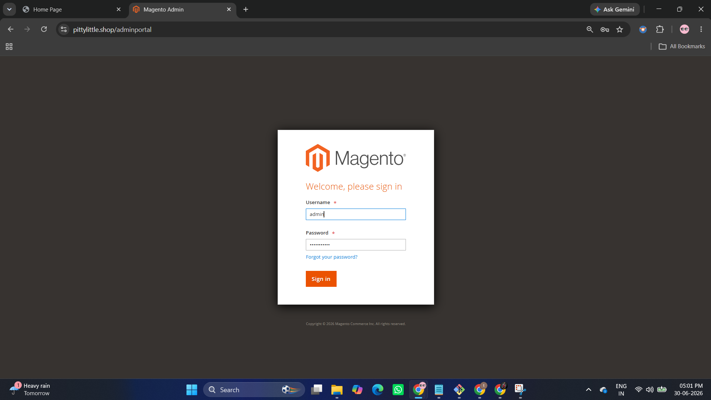
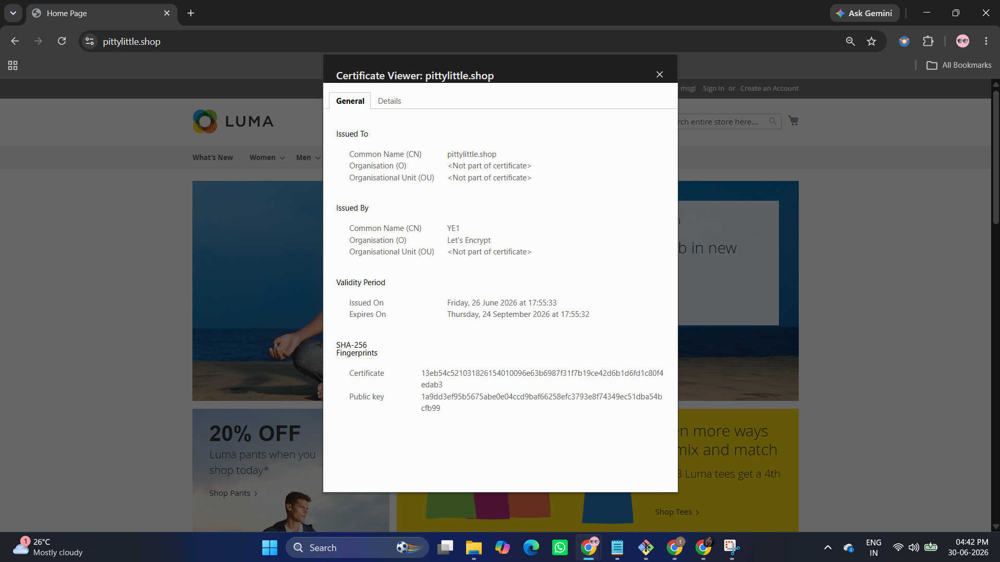
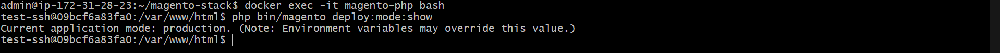
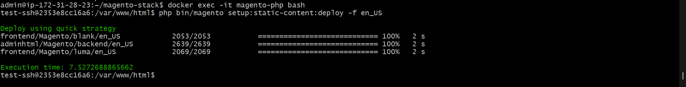

# Magento 2 Production Deployment on AWS using Docker & Docker Compose


---

# Project Overview

This repository demonstrates a complete production-ready deployment of Magento 2 on AWS EC2 using Docker Compose.

The project showcases real-world DevOps implementation including

- Docker
- Docker Compose
- Nginx
- PHP-FPM
- MySQL
- Redis
- OpenSearch
- SSL (Let's Encrypt)
- Custom Domain
- Magento Production Mode
- Static Content Deployment

---

# Live Website

https://pittylittle.shop

---

# Architecture


```
                    Internet
                         │
                    GoDaddy DNS
                         │
                 pittylittle.shop
                         │
                  AWS EC2 Ubuntu
                         │
                 Docker Compose
                         │
 ┌────────────────────────────────────────────┐
 │                                            │
 │   Nginx                                    │
 │      │                                     │
 │   PHP-FPM                                 │
 │      │                                     │
 │   Magento                                 │
 │      │                                     │
 │ MySQL Redis OpenSearch                    │
 │                                            │
 └────────────────────────────────────────────┘
```

---

# Tech Stack

| Component | Version |
|------------|----------|
| AWS EC2 | Ubuntu 24.04 |
| Docker | Latest |
| Docker Compose | Latest |
| Magento | 2.4.x |
| PHP | 8.3 |
| MySQL | 8 |
| Redis | Latest |
| OpenSearch | 2.x |
| Nginx | Alpine |
| SSL | Let's Encrypt |
| Domain | GoDaddy |

---

# Project Structure

```
magento-stack
│
├── docker-compose.yml
├── README.md
├── nginx
├── php
├── scripts
├── cron
├── certs
├── screenshots
└── docs
```

---

# Services

| Container | Purpose |
|------------|----------|
| magento-nginx | Reverse Proxy |
| magento-php | PHP-FPM |
| magento-mysql | Database |
| magento-redis | Cache |
| magento-opensearch | Search |

---

# Features

- Dockerized Magento
- Docker Compose
- Production Mode
- Redis Cache
- Full Page Cache
- OpenSearch
- SSL
- Custom Domain
- HTTPS
- Docker Networking
- Static Content Deployment
- Cron Jobs

---

# Deployment

Clone repository

```bash
git clone https://github.com/yourusername/magento-stack.git
```

Go inside

```bash
cd magento-stack
```

Start containers

```bash
docker compose up -d
```

Verify

```bash
docker ps
```

Deploy Magento

```bash
php bin/magento setup:install
```

Enable production

```bash
php bin/magento deploy:mode:set production
```

Deploy static content

```bash
php bin/magento setup:static-content:deploy -f
```

Flush cache

```bash
php bin/magento cache:flush
```

---

# Screenshots

## Home Page


---

## Docker Containers



---

## Docker Compose



---

## AWS EC2



---

## Magento Admin Login



---

## Magento Dashboard


---

## HTTPS Enabled



---

## Production Mode



---

## Static Content Deployment



---

## Nginx Configuration


---

# Challenges Solved

- Fixed FastCGI buffer overflow
- Fixed Magento static content loading
- Configured Redis
- Configured OpenSearch
- Configured Production Mode
- Configured Docker Networking
- Configured HTTPS
- Configured Custom Domain
- Configured Nginx Reverse Proxy
- Optimized PHP-FPM

---

# Useful Commands

Start

```bash
docker compose up -d
```

Stop

```bash
docker compose down
```

Restart

```bash
docker compose restart
```

Containers

```bash
docker ps
```

Cache Flush

```bash
php bin/magento cache:flush
```

Compile

```bash
php bin/magento setup:di:compile
```

Deploy Static

```bash
php bin/magento setup:static-content:deploy -f
```

Production Mode

```bash
php bin/magento deploy:mode:set production
```

---

# Troubleshooting

## CSS not loading

```bash
php bin/magento setup:static-content:deploy -f
php bin/magento cache:flush
```

## FastCGI 502 Error

Increase Nginx FastCGI buffer size.

## Restart containers

```bash
docker compose restart
```

---

# Future Improvements

- Jenkins Pipeline
- GitHub Actions
- Terraform
- Prometheus
- Grafana
- Loki
- ELK Stack
- AWS Load Balancer
- Auto Scaling
- Kubernetes Migration

---

# Skills Demonstrated

- AWS
- Docker
- Docker Compose
- Linux
- Magento
- Nginx
- PHP
- Redis
- OpenSearch
- MySQL
- DNS
- SSL
- Git
- DevOps

---

# Author

## Rushikesh Sutar

DevOps Engineer

GitHub: https://github.com/sutar-rushikesh

---

This repository is intended for educational and portfolio purposes.
